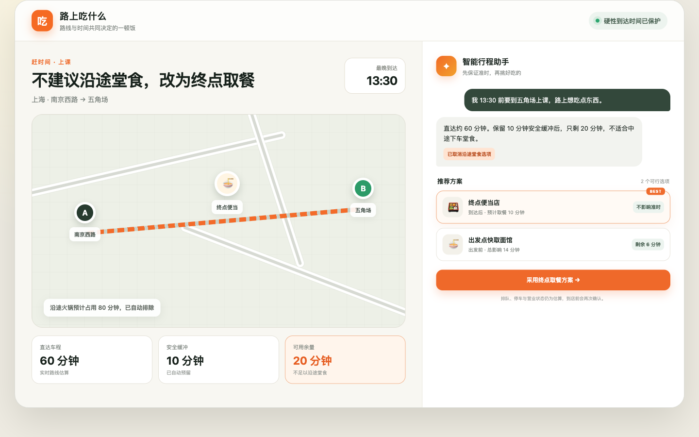
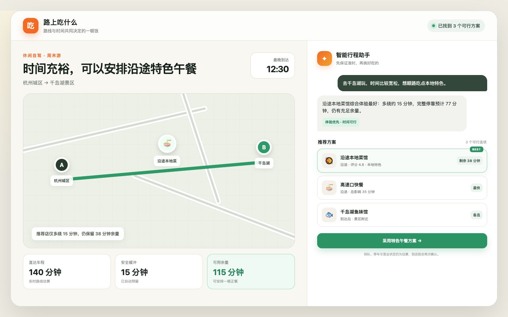

# 路上吃什么 · Road Food Planner

> 不是“附近有什么好吃的”，而是“在不耽误行程的前提下，现在最适合在哪里吃”。

“路上吃什么”是一个路线感知的智能就餐规划插件。它结合起点、终点、出发时间、最晚到达时间、交通方式和饮食偏好，先计算是否有时间吃饭，再推荐出发前、沿途或到达后的可执行方案。





## 为什么做这个项目

普通餐厅推荐通常只考虑距离、评分和口味，却忽略一个更重要的问题：**吃这顿饭会不会让用户迟到？**

对于上课、赶飞机、面试或长途自驾，同一家餐厅可能因为出发时间、实时车程和行程目的不同，从“最佳推荐”变成“绝对不能去”。本项目把时间可行性作为硬约束，把口味和体验放在可行候选内部排序。

## 核心能力

- 自动识别赶时间、通勤、休闲旅行等出行场景；
- 计算直达时间、到达安全缓冲和真正可用的就餐余量；
- 在起点、路线走廊和终点附近召回餐厅；
- 对候选餐厅重新计算 `A → 餐厅 → B` 的真实路线；
- 将停车、步行、排队、出餐和用餐纳入完整停靠成本；
- 时间紧张时优先快取或到达后方案，时间充裕时提高特色体验权重；
- 对关门、超绕路、时间不足和未核实的严重过敏信息进行硬过滤；
- 返回结构化结果，便于大模型解释，也方便未来接入地图卡片或移动端。

## 两个典型决策

### 赶时间

用户有 90 分钟到达目的地，直达需要 60 分钟，系统预留 10 分钟安全缓冲，可支配余量只有 20 分钟。沿途火锅即使评分很高，也会因为完整停靠成本超时而被淘汰；系统改为推荐出发点快取或终点取餐。

### 休闲旅行

用户从杭州前往千岛湖，可支配余量为 115 分钟。沿途本地菜馆虽然比快餐多绕一段时间，但仍满足到达约束，因此体验和口味权重提高，特色餐厅可以排在第一位。

## 决策模型

首先计算时间余量：

```text
行程窗口 = 最晚到达时间 - 出发时间
可支配余量 = 行程窗口 - 直达时间 - 到达安全缓冲
```

对于出发前或沿途候选：

```text
路线绕行 = A → 餐厅 → B - A → B
完整停靠影响 = 路线绕行 + 停车 + 步行 + 排队 + 用餐
```

候选必须同时满足：

```text
路线绕行 ≤ 用户允许的最大绕路时间
完整停靠影响 ≤ 可支配余量
```

只有通过硬约束的候选才进入评分。紧急行程提高时间权重，休闲行程提高口味、评分和体验权重。终点的 `after_arrival` 方案单独标识，不会被误解为“有时间在活动开始前吃完”。

## 架构

```text
用户自然语言
    │
    ▼
宿主大模型 / 对话 Agent
    │  识别场景、补问关键参数
    ▼
plan-enroute-meal Skill
    │
    ▼
plan_enroute_meal MCP Tool
    ├── 地址解析
    ├── 直达路线计算
    ├── 起点 / 沿途 / 终点餐厅召回
    ├── 候选二次算路
    ├── 时间与饮食硬约束过滤
    └── 个性化排序与结构化解释
            │
            ▼
       高德 Web 服务 API
```

模型负责理解和交流，服务端负责可验证的计算。核心规划器不依赖大模型，因此可以独立测试，也能复用于未来的 App、小程序或其他 AI 生态。

## 项目结构

```text
road-food-planner/
├── .codex-plugin/plugin.json        # Codex 插件清单
├── .mcp.json                        # MCP 服务启动配置
├── skills/plan-enroute-meal/        # 场景触发与对话规则
├── server/
│   ├── index.mjs                    # MCP stdio 服务
│   ├── planner.mjs                  # 时间预算、过滤与排序
│   └── amap.mjs                     # 高德地图适配器
├── fixtures/                        # 紧急与休闲样例
├── tests/                           # 规划器、MCP、地图适配器测试
├── preview/                         # 截图使用的静态产品预览
└── assets/                          # README 与插件截图
```

## 快速开始

### 环境要求

- Node.js 20 或更新版本；
- 可选：高德开放平台 Web 服务 Key，用于实时地址、路线和 POI 查询。

本项目的离线规划和测试不依赖第三方 Node 包。

### 运行测试

```bash
npm test
```

### 运行离线演示

```bash
npm run demo
node scripts/demo.mjs fixtures/leisure-trip.json
```

### 启用实时高德数据

在本机运行环境设置密钥：

```bash
export AMAP_WEB_SERVICE_KEY="your-key"
```

密钥不要写入仓库，也不要放在工具调用参数中。实时调用时省略 `directTravelMinutes` 和 `candidateRestaurants`，服务会自动执行地址解析、餐饮 POI 召回和候选二次算路。

## MCP 工具

插件提供一个高层工具：`plan_enroute_meal`。采用单一高层入口可以减少模型多次拼接底层地图调用造成的延迟和计算错误。

最小输入示例：

```json
{
  "origin": "上海市静安区南京西路",
  "destination": "上海市杨浦区五角场",
  "departAt": "2026-09-15T12:00:00+08:00",
  "arriveBy": "2026-09-15T13:30:00+08:00",
  "purpose": "13:30 必须到校上课",
  "travelMode": "driving",
  "mealStyle": "quick_meal",
  "maxRouteDetourMinutes": 10,
  "cuisinePreferences": ["面", "便当"]
}
```

返回内容包括：

- `status`：正常推荐、只建议到达后吃、无可行就餐方案或直达已存在迟到风险；
- `computed`：行程窗口、直达时间、安全缓冲和可支配余量；
- `recommendations`：最多 1—5 个可行候选及分项耗时；
- `rejected`：被淘汰的候选和明确原因；
- `assumptions`：营业、饮食和排队等仍需核实的信息。

## 测试范围

自动测试覆盖：

- 紧急场景淘汰高评分但超时的餐厅；
- 休闲场景允许特色体验超过最快方案；
- 直达行程本身已超出安全预算；
- 非法时间窗口；
- 路线绕行上限与总余量分别生效；
- 关门餐厅硬过滤；
- 严重过敏信息未核实时保守淘汰；
- 非严重饮食偏好未核实时明确提示；
- MCP 初始化、工具发现与工具执行；
- 高德地址解析、路线与餐厅查询的模拟响应和错误传播。

## 隐私与安全

- 地图 Key 只通过本地环境变量传入；
- 不在日志和结构化结果中返回密钥；
- 位置、行程目的和饮食限制可能属于敏感数据，生产环境应最小化留存；
- 排队、停车和用餐时间在首版仍为估算，结果会显式披露；
- 对严重过敏要求默认采用“无法验证即不推荐”的策略。

## 当前限制

- 实时地图模式目前仅支持中国大陆驾车行程和高德 Web API；
- 尚未接入真实排队、停车空位、外卖取餐和订座数据；
- 营业状态无法确认时会标记为未知；
- 当前截图是产品交互预览，不是地图导航界面；
- 尚未实现用户账号、长期偏好、后台定位和主动到点提醒。

## 路线图

1. 建立 50—100 条真实行程评测集，衡量迟到风险和绕路误差；
2. 增加公交、地铁、机场和高铁专用时间模型；
3. 接入营业状态、外卖、停车、排队与订座数据；
4. 增加地图结果卡片、一键导航和途中动态重规划；
5. 用匿名化实际耗时持续校准停车、排队和取餐估算；
6. 在插件验证高频需求后复用同一后端建设移动端。

## 开发说明

每次修改后建议运行：

```bash
npm test
node --check server/index.mjs
```

Codex Skill 与插件清单还应分别通过官方本地验证器。预览页面可通过任意静态文件服务器打开，使用 `?mode=urgent` 和 `?mode=leisure` 切换两种场景。

## License

[MIT](LICENSE)
